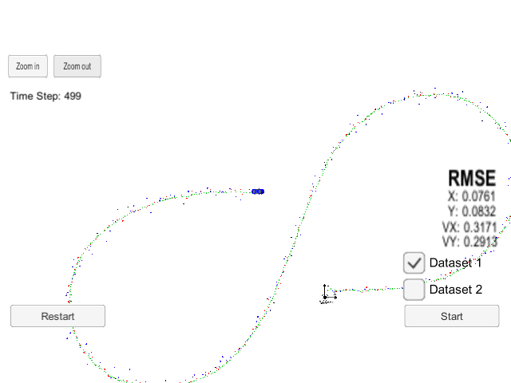
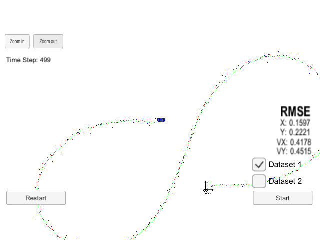
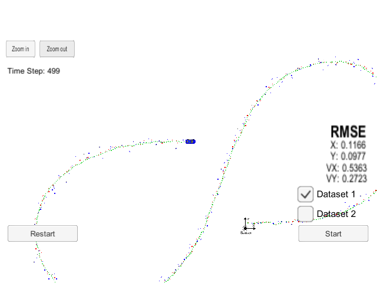
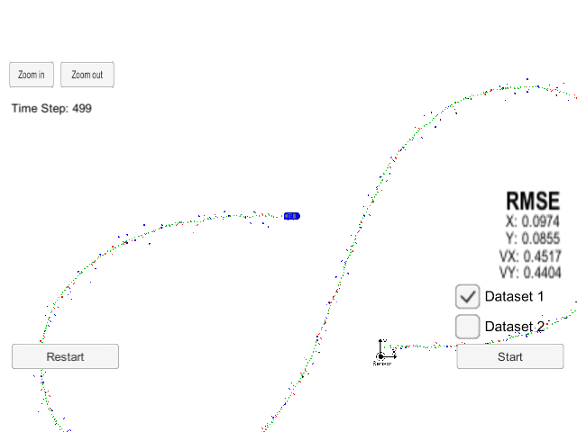

# Unscented Kalman Filter Project 

## Michael DeFilippo

#### Please see my [project code](https://github.com/mikedef/CarND-Unscented-Kalman-Filter) for any questions regarding implementation.
---

** Unscented Kalman Filter (UKF) Project**
---
The goals/steps of this project are the following:
- Install and build UKF project starter code alonge with the project [simulator](https://github.com/udacity/self-driving-car-sim/releases). 
- Implement an UKF in C++ based off the previous lessons using the project starter code and simulator. 
- Create an algorithm that can accomplish better accuracy than [0.09, 0.10, 0.40, 0.30]. 

## Important Dependencies

* cmake >= 3.5
  * All OSes: [click here for installation instructions](https://cmake.org/install/)
* make >= 4.1 (Linux, Mac), 3.81 (Windows)
  * Linux: make is installed by default on most Linux distros
  * Mac: [install Xcode command line tools to get make](https://developer.apple.com/xcode/features/)
  * Windows: [Click here for installation instructions](http://gnuwin32.sourceforge.net/packages/make.htm)
* gcc/g++ >= 5.4
  * Linux: gcc / g++ is installed by default on most Linux distros
  * Mac: same deal as make - [install Xcode command line tools](https://developer.apple.com/xcode/features/)
  * Windows: recommend using [MinGW](http://www.mingw.org/)

## Basic Build Instructions

1. Clone this repo.
2. Make a build directory: `mkdir build && cd build`
3. Compile: `cmake .. && make` 
   * On windows, you may need to run: `cmake .. -G "Unix Makefiles" && make`
4. Run it: `./UnscentedEK `

## Code Style

Please (do your best to) stick to [Google's C++ style guide](https://google.github.io/styleguide/cppguide.html).

## Accuracy
#### The output coordinates px, py, vx, vy must have an RMSE <= [0.09, 0.10, 0.40, 0.30] when using the input file provided. 

The accuracy for px,py,vx,vy respectively are as shown in the above image of 0.07, 0.08, 0.32, 0.29. This is less than the required accuracy for the UKF algorithm. 

## Follows the Correct Algorithm
#### Sensor Fusion algorithm follows the general processing flow as taught in the preceding lessons.
The Unscented Kalman filter implimentation can be found in the following files of [kalman_filter.cpp](https://github.com/mikedef/CarND-Unscented-Kalman-Filter/tree/master/src).

#### Kalman Filter algorithm handles the first measurements appropriately.

The first measurements are handled in UKF.cpp. The program is robust enough to take in either a Laser or Radar measurement first and then initialize the UKF appropriately. 

#### Kalman Filter algorithm first predicts then updates.

In UKF I first predict the state of the vehicle, then I update the state based on the incoming Laser or Radar measurements.

#### Kalman Filter can handle radar and lidar measurements.

The UKF can handle both Radar and Lidar measurements. 

## What's the difference between the combined radar/lidar UKF versus pure radar UKF or a pure lidar UKF?
Below I compare the accuracy of running an UKF with both radar and lidar measurements, versus having just radar measurements, or just lidar measurements. It is clear below that the more data (radar and lidar) will provide a more accurate state estimation.

UKF with Radar and Lidar Measurements

 
UKF with Radar and No Lidar Measurements

UKF with Lidar and No Radar Measurements

EKF to compare to UKF
